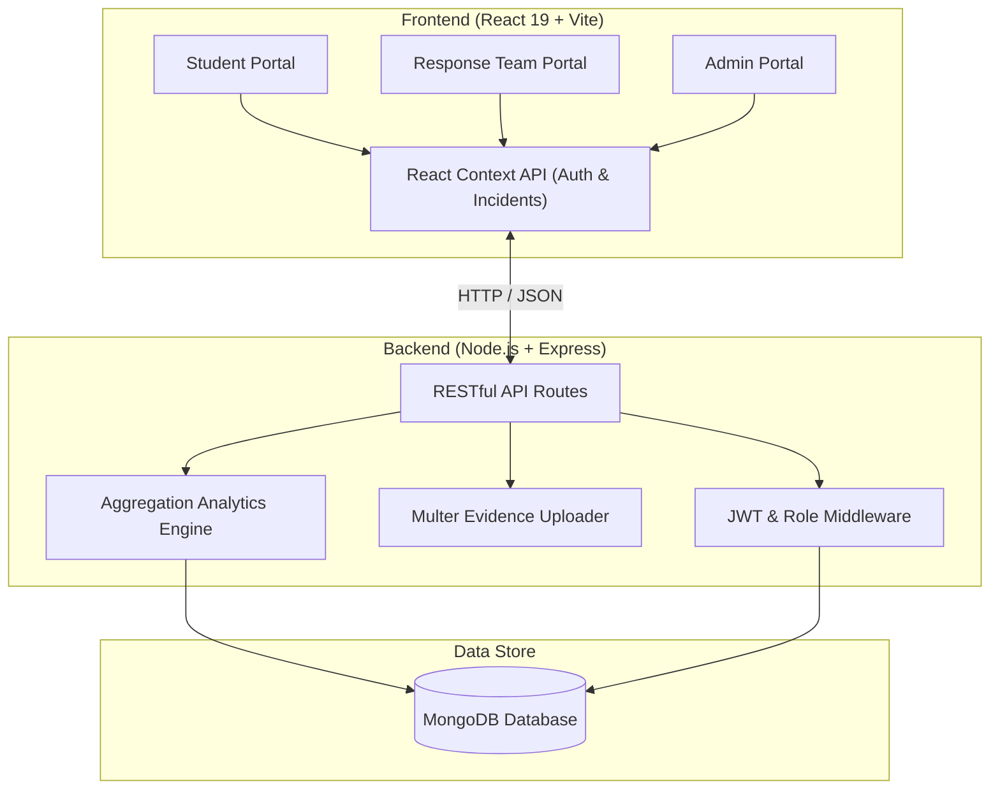

# 🚨 Campus Crisis Management & Emergency Response System (CCMERS)

[](LICENSE)
[](ccmers-frontend)
[](ccmers-backend)
[](ccmers-backend)
[](ccmers-frontend)

**CCMERS** is an enterprise-grade, full-stack emergency response and crisis management system designed for educational institutions and university campuses. It enables real-time reporting, rapid response team dispatch, automated incident routing, role-based workflows, and executive analytics for campus safety operations.

---

## 📑 Table of Contents

- [✨ System Features](#-system-features)
- [🏛 Architecture & Tech Stack](#-architecture--tech-stack)
- [👥 Role-Based Portals](#-role-based-portals)
- [📁 Repository Structure](#-repository-structure)
- [⚙️ Prerequisites & Environment Setup](#️-prerequisites--environment-setup)
- [🚀 Quick Start & Installation](#-quick-start--installation)
- [🔑 Demo Credentials](#-demo-credentials)
- [📡 API Endpoint Reference](#-api-endpoint-reference)
- [🧪 Automated Testing & Postman](#-automated-testing--postman)
- [📜 License](#-license)

---

## ✨ System Features

- **🔐 Role-Based Access Control (RBAC)**: Dedicated login portals and security controls tailored for `Student/Faculty`, `Response Team`, and `Administrator` roles with JWT authentication & Bcrypt password encryption.
- **🚨 Real-Time Incident Reporting**: Fast incident reporting form with geolocation/building selectors, category tagging (Medical, Security, Maintenance, Chemical/Hazardous, IT/Cyber), severity levels, and media/evidence uploads.
- **⚡ Rapid Department Dispatch**: Centralized administration portal to assign incidents directly to response departments (Campus Security, Medical Response, Facilities & Maintenance, IT Support).
- **🔄 Status Lifecycle Tracking**: End-to-end status updates (`Reported` ➔ `Assigned` ➔ `In Progress` ➔ `Resolved` ➔ `Closed`) with mandatory resolution remarks and timeline tracking.
- **📊 Analytics & Insights Engine**: Interactive visual analytics powered by Recharts and MongoDB Aggregation Pipelines to monitor crisis resolution times, category distribution, and department workloads.
- **🛡️ Hybrid State & Resilient Design**: Frontend supports both real-time REST API synchronization and full offline/standalone fallback mode for uninterrupted crisis management testing.

---

## 🏛 Architecture & Tech Stack



### 💻 Stack Breakdown

| Layer | Technologies Used |
|---|---|
| **Frontend Framework** | React 19, Vite 8, React Router DOM v7 |
| **UI & Styling** | Tailwind CSS 3, Lucide React Icons, Framer Motion, React Hot Toast |
| **Data Visualization** | Recharts (Bar Charts, Pie Charts, Trend Analysis) |
| **Backend Runtime** | Node.js, Express.js |
| **Database & ORM** | MongoDB, Mongoose 8 |
| **Security & Auth** | JSON Web Tokens (JWT), Bcrypt.js, CORS |
| **File Storage** | Multer (Local Static Uploads Directory) |
| **Testing & Tools** | Puppeteer, Oxlint, Custom Node API Verification Suite, Postman Collection |

---

## 👥 Role-Based Portals

CCMERS supports 3 primary operational roles across **17 specialized screens**:

### 👨‍🎓 1. Student & Faculty Portal
- **Dashboard**: Quick metrics summary of personal reported issues and urgent campus broadcast notices.
- **Report Incident**: Detailed form to submit emergency incidents, attach photos/documents, and specify location/severity.
- **My Incidents**: Track status progression (`Reported`, `In Progress`, `Resolved`) and responder remarks in real-time.
- **User Profile**: View user credentials, department, and contact info.

### 🛡️ 2. Response Team Portal
- **Responder Dashboard**: Real-time queue of emergency incidents assigned to the responder's department.
- **Assigned Workload**: Filter and sort incidents by priority level (`Critical`, `High`, `Medium`, `Low`).
- **Update Status**: Stepper workflow to update status, append resolution remarks, log time taken, and mark issues resolved.

### 🏢 3. Admin & Safety Officer Portal
- **Command Center Dashboard**: Overview of all active campus emergencies, response health, and pending triage.
- **Incident Dispatch**: Route unassigned incidents to specific departments, adjust severity, and reassign officers.
- **Department Management**: Add, update, or remove response departments and monitor active staff counts.
- **Analytics & Reports**: System-wide performance metrics, incident breakdown by category, resolution efficiency, and peak crisis times.

---

## 📁 Repository Structure

```text
CCMERS-Campus-Crisis-Management-Emergency-Response-System/
├── ccmers-backend/                 # Express.js REST API Server
│   ├── src/
│   │   ├── config/                 # DB connection setup (MongoDB)
│   │   ├── controllers/            # Auth, Incident, Department, Analytics controllers
│   │   ├── middleware/             # Auth JWT, Role Checker, Multer Upload, Error Handling
│   │   ├── models/                 # Mongoose Schemas (User, Incident, Department)
│   │   ├── routes/                 # Express API Endpoint definitions
│   │   └── utils/                  # Seed database script (seedData.js)
│   ├── uploads/                    # Incident attachment storage
│   ├── CCMERS_Postman_Collection.json # Ready-to-import API collection
│   ├── .env                        # Backend environment configuration
│   ├── server.js                   # Node server entry point
│   └── package.json
│
├── ccmers-frontend/                # React + Vite Single Page Application
│   ├── public/                     # Favicons & static web assets
│   ├── src/
│   │   ├── api/                    # Axios / Fetch API service helpers
│   │   ├── components/             # Navigation, Modals, Badges, Protected Routes
│   │   ├── context/                # Global AuthContext & IncidentContext
│   │   ├── layouts/                # Layout wrappers (MainLayout)
│   │   ├── pages/
│   │   │   ├── admin/              # 7 Admin Portal screens
│   │   │   ├── response/           # 5 Response Team Portal screens
│   │   │   └── student/            # 6 Student Portal screens
│   │   ├── App.jsx                 # App routing & provider root
│   │   ├── index.css               # Tailwind CSS imports
│   │   └── main.jsx                # React root renderer
│   ├── tailwind.config.js          # Tailwind design tokens
│   ├── vite.config.js              # Vite server configuration
│   └── package.json
│
├── LICENSE                         # MIT License
└── README.md                       # Project Master Documentation
```

---

## ⚙️ Prerequisites & Environment Setup

### Software Requirements
- **Node.js**: v18.0.0 or higher
- **npm**: v9.0.0 or higher
- **MongoDB**: Local MongoDB server (`mongodb://localhost:27017`) or a MongoDB Atlas connection string.

### Environment Configuration (`ccmers-backend/.env`)

Create or modify `ccmers-backend/.env`:

```env
PORT=5000
MONGO_URI=mongodb://127.0.0.1:27017/ccmers
JWT_SECRET=ccmers_super_secret_jwt_key_2026
NODE_ENV=development
```

---

## 🚀 Quick Start & Installation

### 1. Clone the Repository
```bash
git clone https://github.com/Disha9917/CCMERS-Campus-Crisis-Management-Emergency-Response-System.git
cd CCMERS-Campus-Crisis-Management-Emergency-Response-System
```

### 2. Set Up and Run the Backend API
```bash
# Navigate to backend
cd ccmers-backend

# Install dependencies
npm install

# Seed default database (Creates default users, departments & sample incidents)
npm run seed

# Start API server in development mode
npm run dev
```
*The backend API will run on `http://localhost:5000`.*

### 3. Set Up and Run the Frontend Application
Open a new terminal window:
```bash
# Navigate to frontend
cd ccmers-frontend

# Install dependencies
npm install

# Start Vite dev server
npm run dev
```
*The web interface will be accessible at `http://localhost:5173`.*

---

## 🔑 Demo Credentials

After running `npm run seed`, you can log in to any portal using the following pre-seeded demo accounts:

| Portal | Email | Password | Role |
|---|---|---|---|
| **Student Portal** | `student@campus.edu` | `password123` | `student` |
| **Response Team Portal** | `response@campus.edu` | `password123` | `response` |
| **Admin Command Center** | `admin@campus.edu` | `password123` | `admin` |

---

## 📡 API Endpoint Reference

### Health Check
- `GET /` - Basic API status check
- `GET /api/health` - Extended health & version diagnostics

### Authentication (`/api/auth`)
- `POST /api/auth/register` - Create user account (`student`, `response`, `admin`)
- `POST /api/auth/login` - Authenticate and return JWT token
- `GET /api/auth/me` - Get logged-in user profile (Requires Bearer Token)

### Incident Management (`/api/incidents`)
- `POST /api/incidents` - Report new incident (Student/Admin)
- `GET /api/incidents` - Fetch all campus incidents (Admin)
- `GET /api/incidents/my` - Fetch incidents reported by current student
- `GET /api/incidents/department` - Fetch incidents assigned to responder's department
- `GET /api/incidents/:id` - Get detailed incident record
- `PATCH /api/incidents/:id/status` - Update status & add resolution remarks (Responder/Admin)
- `PATCH /api/incidents/:id/assign` - Assign incident to department & set severity (Admin)

### Department Administration (`/api/departments`)
- `GET /api/departments` - List all response departments
- `POST /api/departments` - Create new department (Admin)
- `PUT /api/departments/:id` - Modify department details (Admin)
- `DELETE /api/departments/:id` - Remove response department (Admin)

### Analytics & Reports (`/api/analytics`)
- `GET /api/analytics` - Fetch aggregated crisis metrics, category distributions, and resolution statistics (Admin)

---

## 🧪 Automated Testing & Postman

### 1. End-to-End API Test Suite
Run the automated REST API integration suite:
```bash
cd ccmers-backend
node scratch/test_api.cjs
```

### 2. Postman Collection
Import `ccmers-backend/CCMERS_Postman_Collection.json` into Postman to test all routes with pre-filled parameters and JWT environment variables.

---

## 📜 License

This project is licensed under the MIT License - see the [LICENSE](LICENSE) file for details.

Developed with ❤️ for safer campus communities.
